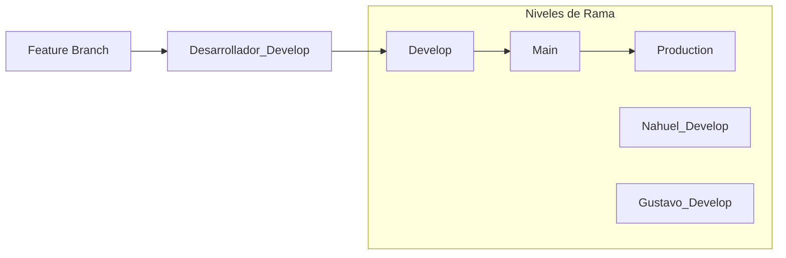

# Actividad Práctica 2 - Programación 3

Este proyecto consiste en la creación de componentes básicos y un dashboard utilizando **React**. 

## 🚀 Tecnologías Utilizadas

- **React** (Vite)
- **Material UI** (Opcional para componentes)
- **JavaScript** (ES6+)

## 🛠️ Instalación y Ejecución

1. Clonar el repositorio:
   ```bash
   git clone <url-del-repositorio>
   ```
2. Instalar dependencias:
   ```bash
   npm install
   ```
3. Ejecutar en modo desarrollo:
   ```bash
   npm run dev
   ```

## 🔄 Proceso de Merge (Git Flow)

Para mantener la integridad del código, seguimos el siguiente flujo de trabajo:



### Pasos Detallados:
1. **Feature Branch**: Crear una rama para cada característica (ej: `feature/boton`).
2. **Desarrollador Develop**: Merge a la rama personal (`Nahuel_Develop` o `Gustavo_Develop`).
3. **Develop**: Integración de las ramas de desarrollador en la rama `develop` común.
4. **Main**: Rama principal para código estable.
5. **Production**: Rama final para el despliegue a producción.

---
© 2024 - Actividad Práctica 2